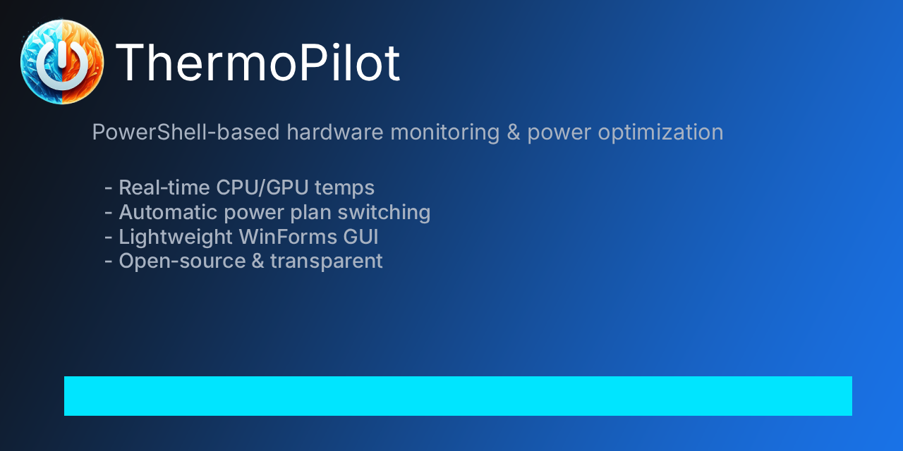
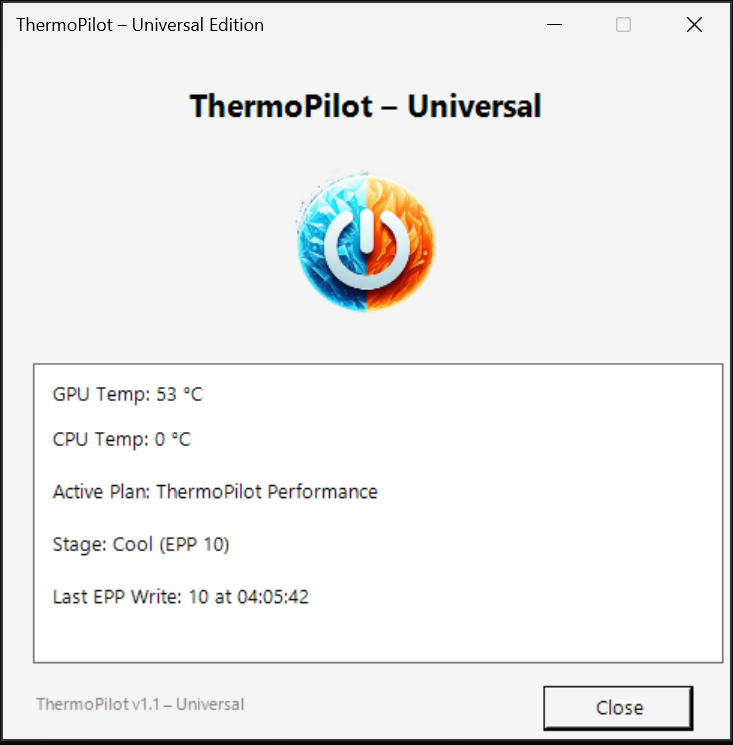

  

# ThermoPilot – Intelligent Thermal Governor for Windows  
**Dynamic GPU‑driven performance control. CPU‑aware safety. Zero firmware hacks.**

ThermoPilot is a lightweight, intelligent thermal governor for Windows that dynamically adjusts CPU Energy Performance Preference (EPP) based on real‑time GPU and CPU temperatures. It delivers smoother performance, quieter operation, and safer thermals — all without touching firmware, drivers, or fan curves.

ThermoPilot fills a gap that Windows and OEM tools never addressed:  
**real‑time, temperature‑based performance scaling.**

---

# 🌟 Why ThermoPilot Exists

Modern laptops push hardware harder than ever:

- shared CPU/GPU thermal budgets  
- aggressive boost algorithms  
- thin chassis with limited cooling  
- OEM tools that only switch static modes  
- Windows power plans that never adjust dynamically  

ThermoPilot introduces a **smart, adaptive thermal governor**:

- GPU‑based thermal stages  
- CPU hard‑override safety  
- dynamic EPP control every 2 seconds  
- universal compatibility  
- zero risk to firmware or hardware  

It behaves like a feature Windows *should* have had — but never did.

---

# 🧬 What Makes ThermoPilot Unique

ThermoPilot is not another “performance mode” switcher or fan‑control utility.  
It introduces a capability that neither Windows nor OEM tools provide:  
**real‑time, temperature‑driven EPP control based on GPU and CPU behavior.**

---

## 🔹 1. Dynamic EPP Control (Windows and OEMs Don’t Do This)

Windows power plans are static.  
OEM tools (PredatorSense, Armoury Crate, MSI Center, Lenovo Vantage) are also static.

They set EPP **once** when you choose a mode.

ThermoPilot is different:

- reads temperatures every 2 seconds  
- adjusts EPP dynamically  
- reacts to real thermal conditions  
- stabilizes performance under fluctuating loads  

This is something **no OEM tool and no Windows feature does.**

---

## 🔹 2. GPU‑Driven Thermal Logic (A First for Windows)

Windows has no native GPU temperature API.  
OEM tools rarely use GPU temperature to influence CPU behavior.

ThermoPilot does.

Modern laptops share thermal budgets between CPU and GPU.  
GPU heat is often the limiting factor — not CPU heat.

ThermoPilot uses GPU temperature as the **primary governor**, making it far more accurate than CPU‑only tools.

---

## 🔹 3. CPU Hard‑Override Safety (Hybrid Thermal Intelligence)

ThermoPilot combines:

- GPU‑based performance scaling  
- CPU‑based safety override  

If the CPU overheats, ThermoPilot immediately raises EPP to reduce boost pressure — even if the GPU is cool.

This hybrid logic mirrors how high‑end gaming laptops manage thermals internally.

---

## 🔹 4. Zero Firmware Access (Safe on Every System)

ThermoPilot never touches:

- EC registers  
- fan curves  
- BIOS settings  
- voltage tables  
- clock multipliers  
- firmware values  

It uses only:

- Windows power APIs  
- standard powercfg commands  
- LibreHardwareMonitor for sensor reading  

This makes it:

- safe  
- reversible  
- OEM‑agnostic  
- compatible with all laptops and desktops  

---

## 🔹 5. Works With Intel Speed Shift and AMD CPPC2

ThermoPilot doesn’t fight modern CPU boost technologies — it **guides** them.

### ✔ Intel Speed Shift (HWP)
Intel Speed Shift uses EPP as its primary hint for:

- responsiveness  
- boost aggressiveness  
- power draw  
- thermal behavior  

ThermoPilot dynamically adjusts EPP, which Speed Shift responds to instantly.

This gives you:

- smoother boost behavior  
- fewer thermal spikes  
- more consistent performance  

### ✔ AMD CPPC2
AMD’s CPPC2 system also uses EPP as a performance hint.

ThermoPilot’s dynamic EPP adjustments allow AMD CPUs to:

- boost harder when cool  
- back off when hot  
- avoid thermal throttling  
- maintain stable clocks  

ThermoPilot works *with* the CPU, not against it.

---

## 🔹 6. Universal Compatibility (Even on Locked Systems)

ThermoPilot works on:

- Intel  
- AMD  
- NVIDIA  
- Acer  
- ASUS  
- MSI  
- Lenovo  
- Dell  
- HP  
- desktops  
- laptops  

Even on systems with locked CPU sensors (Acer), ThermoPilot still provides:

- full GPU‑based thermal control  
- stable performance  
- safe EPP behavior  

The Acer Edition ensures compatibility even when CPU telemetry is hidden.

---

## 🔹 7. A True Thermal Governor for Windows

ThermoPilot behaves like a Linux‑style thermal governor:

- monitors temps  
- adjusts performance  
- prevents throttling  
- stabilizes workloads  
- protects hardware  

Windows has never offered this.  
OEM tools don’t offer this.  
No third‑party tool offers this in a universal, firmware‑safe way.

ThermoPilot is the missing thermal layer Windows never built.

---

# 🖥️ Editions

## **Universal Edition**
For most systems. Supports:

- GPU temperature detection  
- CPU temperature detection (if exposed by firmware)  
- GPU‑based thermal stages  
- CPU hard‑override safety  
- dynamic EPP control  

## **Acer Edition**
For Acer laptops with locked CPU sensors.

Acer firmware often hides CPU temperature from Windows and from tools like LibreHardwareMonitor. When this happens:

- CPU temp shows **0°C**, **N/A**, or stays blank  
- CPU override cannot activate  
- GPU governor still works perfectly  

If your CPU temp does not display, use the **Acer Edition**.

---

# ⚙️ How ThermoPilot Works

## 🎯 GPU‑Based Thermal Stages (Primary Governor)

| Stage | Temp Range | EPP | Behavior |
|-------|------------|-----|----------|
| **Cool** | 0–55°C | 10 | Maximum responsiveness |
| **Warm** | 56–70°C | 35 | Balanced performance |
| **Hot** | 71–75°C | 55 | Reduced boost to stabilize temps |

---

## 🔥 CPU Hard Safety Override

If CPU temperature is available:

- **≥ 90°C** → EPP 60 (CPU HOT)  
- **≥ 95°C** → EPP 90 (CPU MAX)  

If CPU temp is hidden (Acer), this feature is automatically disabled.

---

# 🖼️ ThermoPilot GUI Preview

The ThermoPilot GUI provides real‑time visibility into GPU and CPU temperatures,
current EPP value, active thermal stage, and CPU override status — all presented
in a clean, lightweight interface designed for clarity and ease of use.

---

# 🧩 Interaction with OEM Tools

ThermoPilot does **not** conflict with OEM tools in any harmful way.

It does **not**:

- modify firmware  
- change fan curves  
- access EC registers  
- override boost algorithms directly  

OEM tools typically set EPP **once** when you choose a mode.  
ThermoPilot adjusts EPP **continuously**, so it simply takes priority.

---

# 🛑 Stopping ThermoPilot Safely (Important)

If you run ThermoPilot inside **PowerShell ISE**, do **not** click the red ■ Stop button.

PowerShell ISE force‑kills the script engine while the ThermoPilot window is still running, causing a .NET Framework **Unhandled Exception** dialog.

This is normal for *any* WinForms script in ISE.

### ✔ Correct ways to stop ThermoPilot
- Click the **Close** button inside the ThermoPilot window  
- Press **Ctrl + C** in the ISE console pane  
- Run ThermoPilot from Windows Terminal or PowerShell.exe  

ThermoPilot shuts down cleanly when closed from its own window.

---

# 📦 Installation

1. Download the edition appropriate for your system.  
2. Place `ThermoPilot.ps1` and `LibreHardwareMonitorLib.dll` in the same folder.  
3. (Optional) Add your ThermoPilot logo PNG.  
4. Open PowerShell ISE.  
5. Load the script and **save it** before running.  
6. Press **F5** to launch the GUI.

---

# 🧪 System Compatibility

### ✔ Works on:
- Windows 10 / 11  
- Intel and AMD CPUs  
- NVIDIA and AMD GPUs  
- Laptops and desktops  
- OEM systems (Acer, ASUS, MSI, Lenovo, Dell, HP, etc.)  

### ❗ Limitations:
- Some Acer laptops hide CPU sensors → use Acer Edition  
- Some corporate systems lock power‑plan editing  

---

# 📚 Documentation

- [FAQ](FAQ.md)  
- [Troubleshooting](TROUBLESHOOTING.md)  

---

# 📝 License

MIT License.  
ThermoPilot is free to use, modify, and distribute.

---

# 🤝 Contributing

Pull requests, feature suggestions, and improvements are welcome.  
ThermoPilot is designed to be simple, safe, and community‑friendly.

---

# 👤 About the Developer

ThermoPilot is developed by a creator with a unique blend of experience across  
**HVAC‑R thermal systems**, **Windows performance engineering**, and **cybersecurity (Blue Team / SOC analysis)**.

My background includes:

- HVAC‑R training in heat transfer, airflow dynamics, and system load balancing  
- hands‑on troubleshooting across both physical and digital systems  
- Windows internals, power‑management behavior, and hardware telemetry  
- early‑stage Blue Team and SOC analyst training, with a strong focus on system behavior, detection logic, and monitoring  

Although I’m still early in my cybersecurity journey, I learn quickly, retain information well, and approach every problem with a deep troubleshooting mindset. When I start something, I don’t stop until I understand it fully — that’s the same drive that led to ThermoPilot’s creation.

ThermoPilot reflects the intersection of everything I enjoy:  
**understanding systems, analyzing behavior, solving problems, and building tools that make technology safer and more efficient.**

I’m actively transitioning these skills into a long‑term professional career — whether in:

- Windows performance engineering  
- gaming hardware optimization  
- system‑level software development  
- cybersecurity / SOC analysis  
- or a hybrid role that blends both worlds  

I’m passionate about refining my craft, and moving into a full‑time role would allow me to take projects like ThermoPilot even further. If you work in the Windows, gaming, hardware, or cybersecurity space and are interested in collaboration, integration, or professional opportunities, feel free to reach out through GitHub.

I would love to contribute to a team focused on improving system performance, protecting users, or building the next generation of Windows power and thermal technologies.
